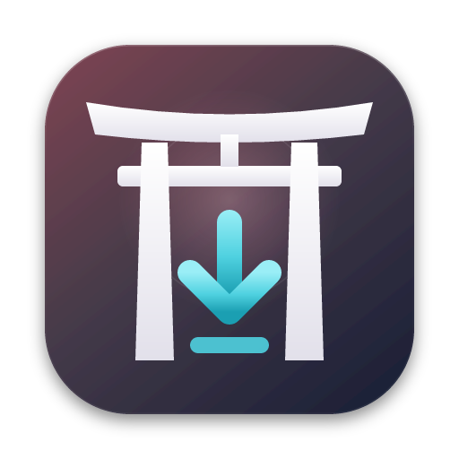

# ITANI App — download

Installer ufficiali di **ITANI App** (fino alla v1.2.00 “Anime Builder”, fino alla v1.3 “ITANI Downloader”) e file usati dall'aggiornamento automatico dell'app.
Il codice sorgente non è pubblico: questo repository contiene solo le release.

## Scarica l'ultima versione

Vai su **[Releases → Latest](https://github.com/Zaruka96/ITANI-App-releases/releases/latest)** e scegli il file per il tuo sistema:

| Sistema | File |
|---|---|
| Windows 10/11 (x64) | `ITANI-App_<versione>_windows-x64-setup.exe` (oppure `.msi`) |
| macOS (Apple Silicon e Intel) | `ITANI-App_<versione>_macos-universal.dmg` |
| Android (arm64) | `ITANI-App_<versione>_android.apk` |
| iPhone / iPad (iOS 15+) | `ITANI-App_<versione>_ios-unsigned.ipa` (vedi sotto) |
| Docker / NAS | `docker pull ghcr.io/zaruka96/itani-app:latest` |

### Primo avvio

Le app non sono firmate con certificati Apple/Microsoft:

- **macOS**: dopo aver trascinato l'app in Applicazioni, clic destro sull'app → **Apri** → **Apri**. Se macOS dice che l'app è danneggiata: `xattr -dr com.apple.quarantine "/Applications/ITANI App.app"`.
- **Windows**: se compare SmartScreen, **Ulteriori informazioni** → **Esegui comunque**.
- **Android**: apri l'APK dal telefono e consenti l'installazione da origini sconosciute quando richiesto.
- **iOS**: l'IPA non è firmato. Installalo dal computer con [Sideloadly](https://sideloadly.io) o [AltStore](https://altstore.io) usando il tuo Apple ID; con un Apple ID gratuito l'app va reinstallata ogni 7 giorni.

Su Windows e macOS gli aggiornamenti arrivano direttamente dall'app (controllo a ogni avvio o da Impostazioni → Aggiornamenti). Su Android e iOS si installa il nuovo file da questa pagina.
